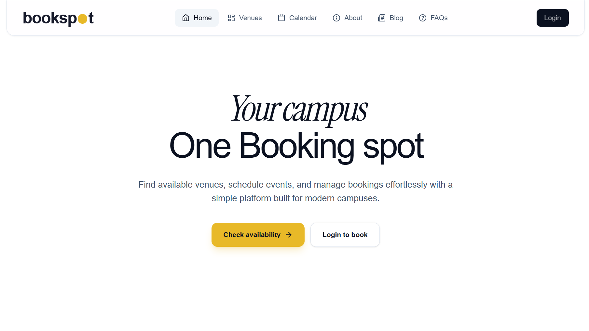
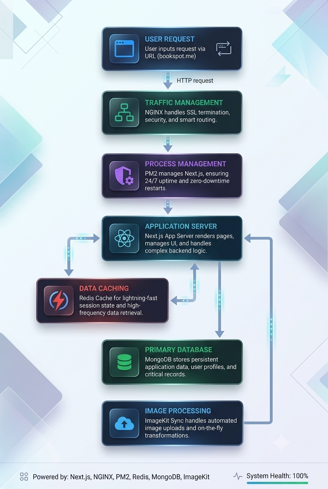
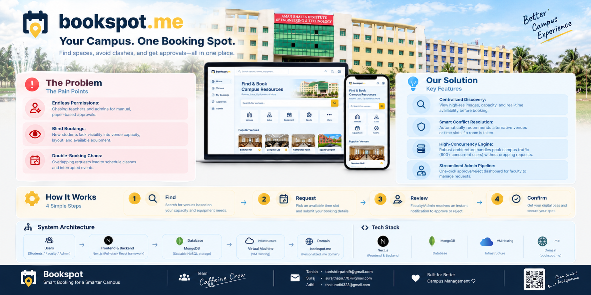

# Bookspot

Bookspot is a campus venue booking platform. Students find and book shared spaces (like halls or meeting rooms). Administrators manage those spaces and approve or reject booking requests.

---

[](https://bookspot.me)



## The Problem

Booking a campus venue is usually messy — spread across group chats, spreadsheets, and manual checks. This causes three issues:

- **Students** can't easily see which venues fit their needs or what equipment is available.
- **Administrators** waste time manually checking capacity, schedules, and requests.
- **Conflicts happen** when there's no shared system tracking who booked what, and when.

Bookspot fixes this by giving everyone one shared, always-up-to-date system.

---

## Who Uses Bookspot

### Students can:

- log in
- Browse venues and see photos, capacity, building, and available equipment
- Request a booking (date, time, expected attendance, reason, equipment needed)
- Track the status of their requests from a dashboard or calendar

### Administrators can:

- Log in with admin access
- Add new venues (with photos, capacity, and equipment lists)
- Review incoming booking requests
- Approve or reject requests
- View all registered users and campus-wide booking activity

---

## Booking Equipment

Each venue lists which equipment it has available. Students pick from this list when booking. Supported equipment:

- Speaker
- Microphone
- Projector
- Whiteboard
- Air conditioning
- Stage

**Two safety checks happen on every booking:**

1. The equipment requested must be a real, supported type.
2. The equipment must actually be available at that specific venue.

Whatever equipment was requested is saved with the booking, so both students and admins can see it later.

---

## How It's Built

| Technology         | What it's for                                                     |
| ------------------ | ----------------------------------------------------------------- |
| Next.js 16.3.4     | Powers the web pages and backend API in one app                   |
| React 19.2.8       | Builds the interactive screens (booking, dashboards, admin tools) |
| TypeScript         | Keeps data consistent and catches errors early                    |
| Tailwind CSS 4     | Styling and visual design                                         |
| MongoDB            | Stores users, venues, and bookings                                |
| Mongoose           | Manages database structure and queries                            |
| Redis              | Speeds up venue browsing with caching                             |
| ImageKit           | Hosts and serves venue photos                                     |
| bcrypt             | Encrypts passwords                                                |
| jsonwebtoken (JWT) | Handles secure login sessions                                     |
| lucide-react       | Icons used across the interface                                   |
| PM2, Nginx, VPS    | Planned for production hosting (not yet set up in this repo)      |

---

## How Data Flows

```text
Browser
  |
  +-- Web pages (Next.js + React)
  |
  +-- Backend API
        |
        +-- Checks login (JWT cookie)
        +-- Validates incoming requests
        +-- Talks to MongoDB (main database)
        +-- Talks to Redis (fast cache)
        +-- Talks to ImageKit (venue photos)
```



### Reading venue data (fast path)

When someone loads the venue list, Bookspot tries to serve it quickly using a cache:

1. Check Redis first (a fast, temporary storage layer).
2. **If found:** return the cached list immediately.
3. **If not found:** fetch fresh data from MongoDB, save a copy in Redis for next time, then return it.
4. Cached data expires automatically after 60 seconds, so it never gets too stale.

> Redis only makes _reading_ venues faster. It never decides whether a booking is valid — that's always checked directly against the real database.

### Submitting a booking (accurate path)

Bookings always go straight to the main database — no caching — because accuracy matters more than speed here. Every request goes through these checks, in order:

1. Confirm the user is logged in.
2. Validate the venue, date, time, attendance number, reason, and equipment list.
3. Reject the request if the date is in the past.
4. Confirm the user and venue both exist.
5. Reject if attendance exceeds the venue's capacity.
6. Reject if requested equipment isn't offered by that venue.
7. Check for any overlapping bookings at that time.
8. If everything passes, save the booking as "pending" and add it to the student's history.

---

## Data Structure

### Venue

```text
name       (text)
building   (text)
capacity   (number)
images     (list of photo links)
resources  (list of equipment)
createdAt  (date created)
updatedAt  (date last changed)
```

### Booking

```text
venue_id          (which venue)
user_id           (who booked it)
starting_time     (start of booking)
ending_time       (end of booking)
date              (day of booking)
numberofStudents  (expected attendance)
resources         (equipment requested)
reason            (purpose of event)
status            (see below)
createdAt         (date created)
updatedAt         (date last changed)
```

### Booking Status Meanings

| Status      | Meaning                             |
| ----------- | ----------------------------------- |
| `pending`   | Waiting for an admin to review it   |
| `approved`  | Accepted by an admin                |
| `rejected`  | Declined by an admin                |
| `cancelled` | Cancelled by the student            |
| `completed` | The event's time has already passed |

---

## Pages & API Routes

### Website Pages

| Page                  | What it does                               |
| --------------------- | ------------------------------------------ |
| `/`                   | Homepage                                   |
| `/venue`              | Browse all venues                          |
| `/venue/[id]`         | View one venue and book it                 |
| `/user`               | Student's personal dashboard               |
| `/calendar`           | Calendar view of bookings                  |
| `/profile`            | User's profile settings                    |
| `/admin`              | Admin dashboard for reviewing bookings     |
| `/admin/create-venue` | Form to add a new venue                    |
| `/about`              | About the product and team                 |
| `/blog`               | Technical write-up and performance results |
| `/faqs`               | Frequently asked questions                 |
| `/auth/login`         | Login page                                 |

### API Endpoints

| Endpoint                | Method      | What it does                             |
| ----------------------- | ----------- | ---------------------------------------- |
| `/api/regester`         | POST        | Create a new account                     |
| `/api/login`            | POST        | Log in                                   |
| `/api/logout`           | POST        | Log out                                  |
| `/api/me`               | GET         | Get the currently logged-in user         |
| `/api/venue`            | GET         | List all venues (cached)                 |
| `/api/venue/[id]`       | GET         | Get one venue's details                  |
| `/api/Create-venue`     | POST        | Add a new venue (admin only)             |
| `/api/booking`          | GET         | Get the current user's bookings          |
| `/api/booking`          | POST        | Submit a new booking request             |
| `/api/booking/all`      | GET         | View all campus bookings                 |
| `/api/admin/bookings`   | GET / PATCH | Review and update booking status (admin) |
| `/api/admin/users`      | GET         | List all users (admin)                   |
| `/api/admin/users/[id]` | PATCH       | Update a user's permissions (admin)      |

---

## Running It Locally

### You'll need:

- Node.js 20+
- npm
- A MongoDB connection string
- A Redis instance (local or hosted)
- An ImageKit account (only needed if uploading venue images)

### 1. Install dependencies

```bash
npm install
```

### 2. Set up environment variables

Create a file named `.env.local` in the project root:

```env
MONGODB_URI=mongodb://127.0.0.1:27017/bookspot
REDIS_URL=redis://127.0.0.1:6379
JWT_SECRET=replace-with-a-long-random-secret
IMAGEKIT_PUBLIC_KEY=your-imagekit-public-key
IMAGEKIT_PRIVATE_KEY=your-imagekit-private-key
IMAGEKIT_URL_ENDPOINT=https://ik.imagekit.io/your-imagekit-id
```

⚠️ Never commit `.env.local` or share your secret values.

### 3. Start the app

```bash
npm run dev
```

Then open [http://localhost:3000](https://bookspot.me).

### Production commands

```bash
npm run build
npm run start
```

### Optional quality checks

```bash
npm run lint        # check code style
npx tsc --noEmit     # check for type errors
git diff --check     # check for merge conflict leftovers
```

---

## Performance Results

Bookspot's team tested the venue-loading system under 1,000 concurrent users, both **before** and **after** adding Redis caching:

| Metric                |       Before Redis |        After Redis |             Improvement |
| --------------------- | -----------------: | -----------------: | ----------------------: |
| Throughput            | 139.6 requests/sec | 393.7 requests/sec |               **+182%** |
| Average response time |              3.76s |             0.157s |         **~96% faster** |
| P95 response time     |              5.06s |             0.708s |         **~86% faster** |
| Failed requests       |              9.47% |                 0% | **100% fewer failures** |

**In short:** adding Redis made venue browsing much faster and far more reliable under heavy load — without changing how bookings are validated. Booking creation still goes straight to the database every time, because correctness matters more than speed there.

_Note: these are results from one specific test, not a guarantee for every setup or workload._

---

## Security Basics

- Passwords are hashed with bcrypt (never stored in plain text)
- Login sessions use secure, HttpOnly JWT cookies
- Admin actions are checked on the server, not just hidden in the UI
- All booking data is validated on the server — the app never trusts data from the browser alone
- Uploaded images are checked to make sure they're actually images, and failed uploads are cleaned up
- Uploads and venue creation have timeouts, so the app doesn't hang indefinitely
- MongoDB is always the final word on whether a booking conflicts with another

---

## Project Structure

```text
app/                 Pages and API routes
components/          Shared UI pieces (like the navbar)
lib/                 Helper code for MongoDB, Redis, ImageKit, etc.
modal/               Database models (users, venues, bookings)
booking.types.ts     Shared TypeScript types for bookings
public/              Static files (images, icons, etc.)
PROMPT.md            Notes used to build this project
AGENTS.md            Instructions specific to this repo
```

---

## Current Scope

Right now, Bookspot handles: browsing venues, submitting booking requests, selecting equipment, logging in, and admin approval — with a fast, cached venue-browsing experience.

**Not yet included:** production deployment setup (Nginx, PM2, or an automated deployment pipeline). That's planned, but not built yet.

---

## License

No license has been chosen for this project yet.

---

## Project Overview


